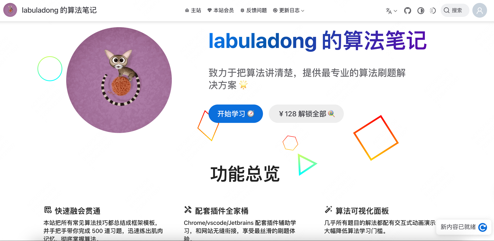

## 面试算法资源推荐
### 1. 代码随想录

网站链接：https://programmercarl.com/

网站介绍：对于刷题，我们都是想用最短的时间按照循序渐进的难度顺序把经典题目都做一遍，这样效率才是最高的！而且一个正确的刷题顺序对算法学习是非常重要的！所以网站的大神卡尔整理了leetcode刷题攻略：一个超级详细的刷题顺序，每道题目都是我精心筛选，都是经典题目高频面试题，大家只要按照这个顺序刷就可以了，你没看错，左面的菜单栏就是刷题顺序，每一个专题，挨个刷就可以，不用自己再去题海里选题了！而且每道题目我都写了的详细题解（图文并茂，难点配有视频），我的题解已经陪伴了几万录友渡过了算法学习旅程，质量是有目共睹的。那么现在我把刷题顺序都整理出来，是为了帮助更多的学习算法的同学少走弯路！如果你在刷leetcode，强烈建议先按照本站的题目顺序来刷，刷完了你会发现对整个知识体系有一个质的飞跃，不用在题海茫然的寻找方向。

最重要的是这个网站是**免费**的！

### 2. hot100

网站链接：https://leetcode.cn/studyplan/top-100-liked/

网站介绍：快速、高效地提高你的算法功底和解决问题的能力。
准备技术面试的“捷径”，这些题目通常在不同公司的面试中不断重复出现。
增强思维能力，培养更复杂算法的思维框架，为以后更复杂的项目打下坚实的基础。

### 3. labuladong算法笔记

网站链接：https://labuladong.online/algo/

网站介绍：
Labuladong 的算法笔记网站是一个致力于将算法讲解清楚并提供专业刷题解决方案的平台。网站总结了所有常见的算法技巧，提供框架模板，并手把手带领用户完成500道习题，帮助用户迅速掌握算法。网站提供了Chrome、VSCode、Jetbrains等插件，辅助学习并与网站无缝衔接，提升刷题体验。几乎所有题目的解法都配有交互式动画演示，降低算法学习门槛。数据结构和递归算法等均有可视化支持。网站设有讨论区，用户可以进行思维碰撞和友好交流，作者也会定期回答问题。

但是这个是**收费**的（一年100多）