# Java 后端学习路线

**这个路线完全面向于找后端工作，会给出最稳定的学习路线**

## java 语言的学习

语言基础学好后对整个后端体系起支撑性作用，细节比较多，需要 1-2 个月的视频沉淀，我们选择经典的 java 入门中文视频

别的视频比如黑马，尚硅谷等没有这个细节

【【零基础 快速学Java】韩顺平 零基础30天学会Java】https://www.bilibili.com/video/BV1fh411y7R8?vd_source=94f7ec5135fe225cc2503acda330c046

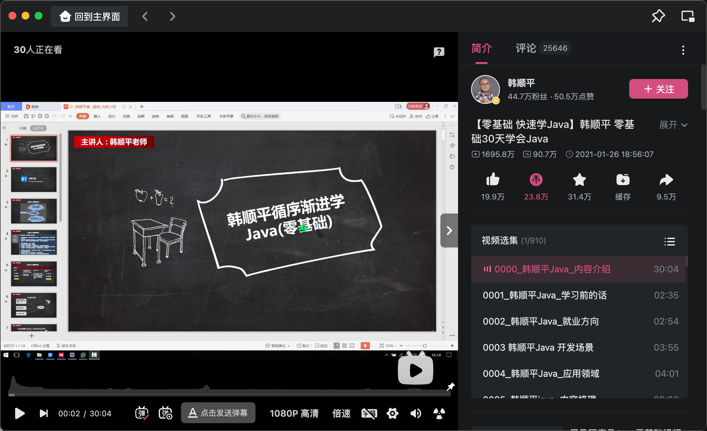

其中有一些案例感兴趣的可以做，单纯学习 java 可以跳过

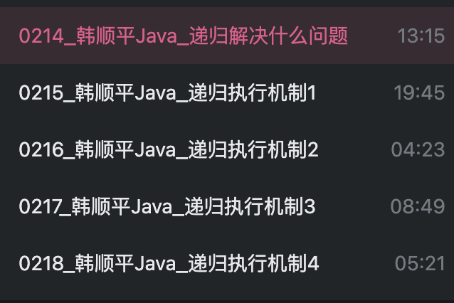

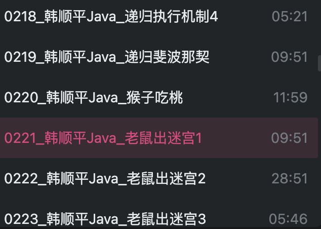

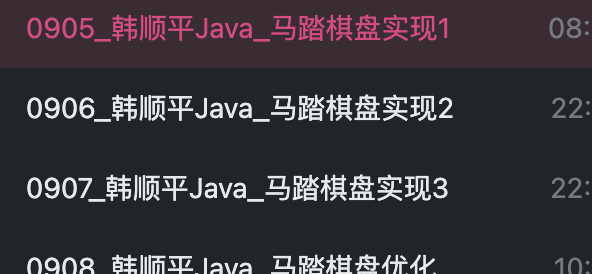

这个坦克大战要自己学懂要一定时间，可以跳过

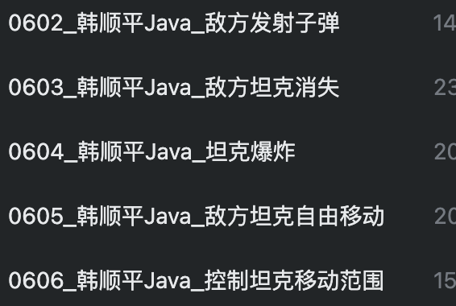

## 数据持久层软件 MySQL

在韩顺平 java 中就提到过，但是 MySQL 中的进阶点的知识也是需要学习的，这里推荐经典黑马的 MySQL

### 入门学习
【黑马程序员 MySQL数据库入门到精通，从mysql安装到mysql高级、mysql优化全囊括】https://www.bilibili.com/video/BV1Kr4y1i7ru?vd_source=94f7ec5135fe225cc2503acda330c046
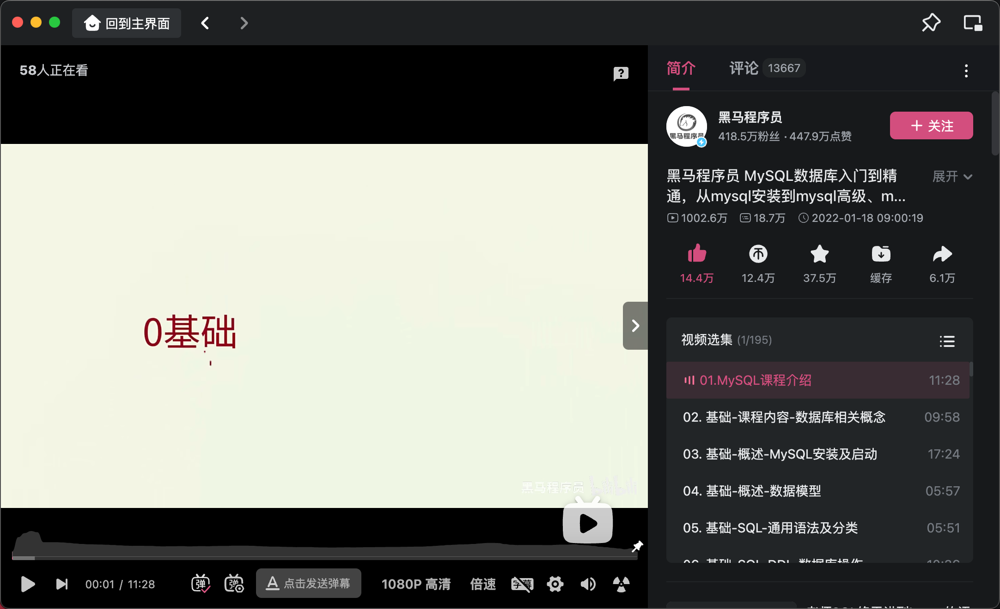
暂时学习完基础篇和进阶篇就行，等以后要提升了再看运维篇和**MySQL 45**，进阶篇最好过一段时间就温习一次，很可能会温故而知新

### 进阶学习-Mysql45讲
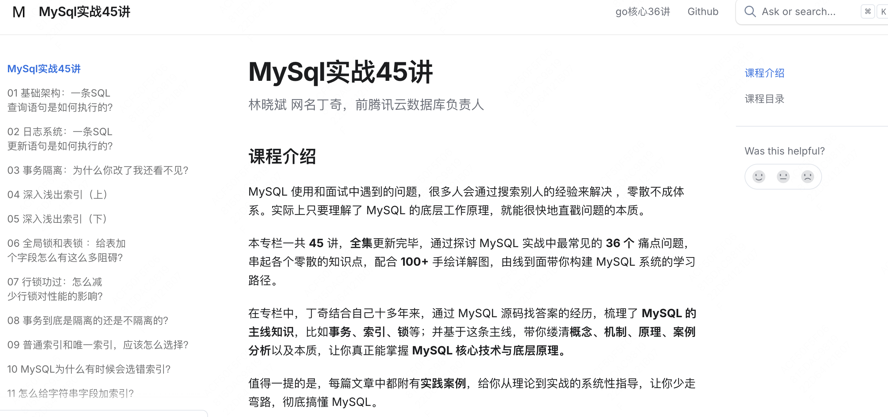
地址：https://github.com/boollife/mysql45

## java web

java 后端都是要接触网络的，这个视频快速看一遍，有印象就行

【尚硅谷全新JavaWeb教程，企业主流javaweb技术栈】https://www.bilibili.com/video/BV1UN411x7xe?p=194&vd_source=94f7ec5135fe225cc2503acda330c046

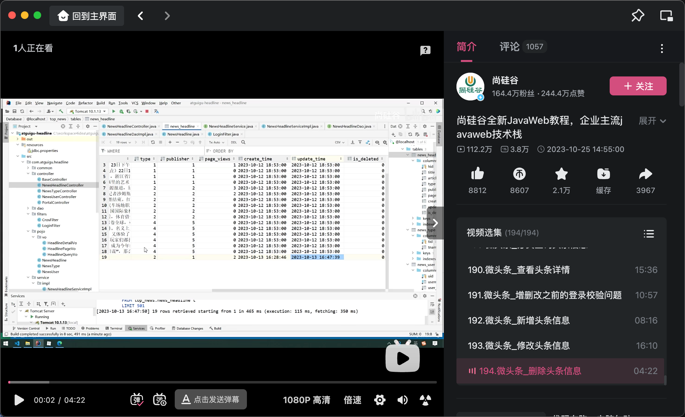

## 经典 Spring 

java 能被选为常用后端开发语言的重要原因之一就是在框架的帮助下开发速度快，这些框架社区活跃，稳定性有保障

【【Spring5】尚硅谷Spring5教程】https://www.bilibili.com/video/BV1yq4y1Q7N7?vd_source=94f7ec5135fe225cc2503acda330c046

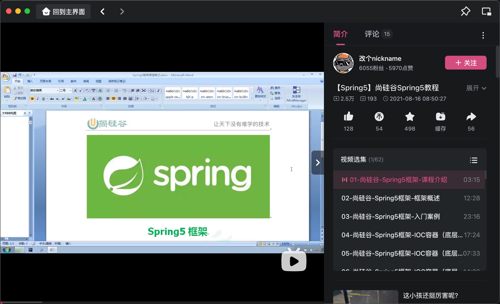

java 网络请求的处理在 spring 体系中被封装成 mvc，第一次学习这个只需要会基础的使用，有印象就行，等以后熟悉了可以去看看源码

【【尚硅谷】SpringMVC教程丨一套快速上手spring mvc】https://www.bilibili.com/video/BV1Ry4y1574R?vd_source=94f7ec5135fe225cc2503acda330c046

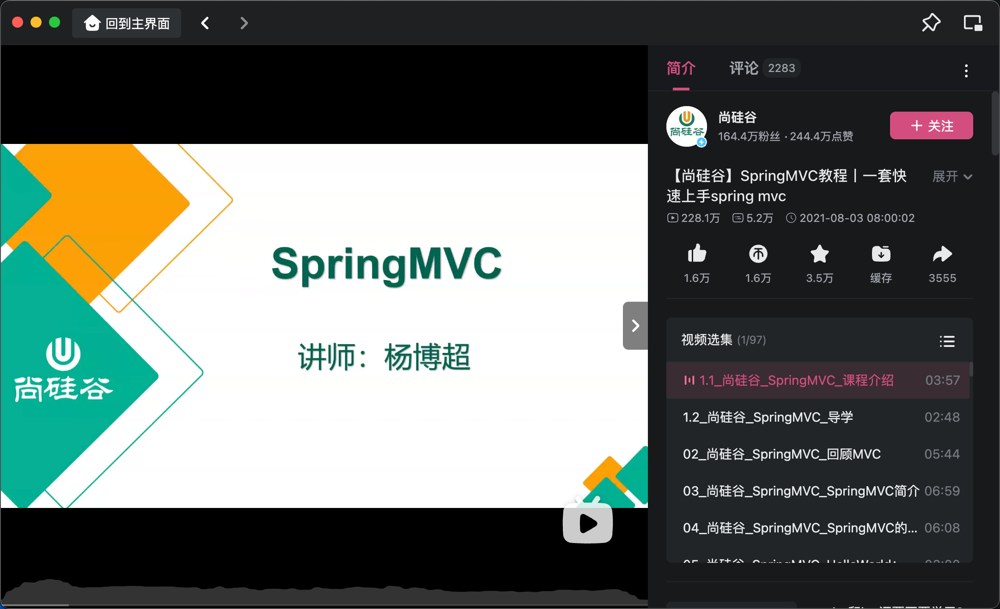

spring boot 简化了 spring 项目的开发，优化掉了繁琐的配置文件，很多配置都在 spring boot 中存在默认值

【尚硅谷SpringBoot3零基础教程，面试&加薪必会springboot（含响应式编程）】https://www.bilibili.com/video/BV1Es4y1q7Bf?vd_source=94f7ec5135fe225cc2503acda330c046

这个能通过 idea 软件快速构建一个项目就行了，这个视频一天以内学习如何使用基础的 spring boot 就行，至于中间一些组件的运行逻辑以后有兴趣就学，比如我个人是在学习这个一年后才明白大致的 spring boot 启动流程，中间一些组件的运行逻辑

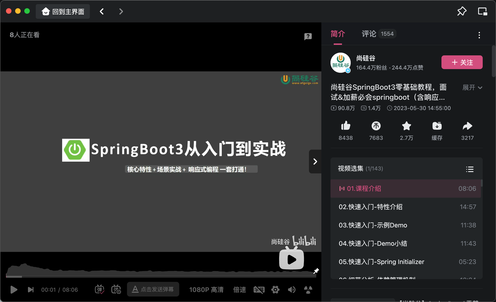

---
| **作者**：whut2024 |  |
|-------------------------------|----------------------------------------------------------------------------------------------------|

