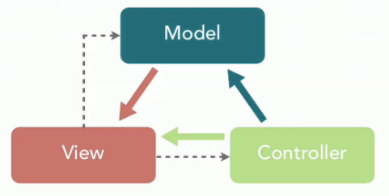

## java开发相关的框架

### Spring框架

-----

### Spring SpringMVC SpringBoot

-----

#### Spring

1. 核心功能

   - `AOP`     

   - `IOC ` 

2. 重要模块

   - Core Container

   - AOP

   - Data Access

   - Spring Web

   - Spring Test

----

#### Spring MVC

Spring MVC是Spring的一个模块，主要赋予Spring快速构建MVC架构的Web程序的能力，MVC是模型(Model)、视图(View)、控制器(Controller)的简写，核心思想是通过将业务逻辑、数据、显示分离来组织代码

#### Spring Boot

Spring Boot的核心目标是通过简化配置，优化依赖管理、加速项目启动和部署流程

包括以下几个部分

- 执行器：监控和跟踪应用程序

- 服务器

- 异常处理机制

- 依赖项管理

- 自动化配置

学习建议：

- 初学：使用SpringBoot做一个简单的demo，了解SpringBoot的使用，了解项目构建工具Maven/Gradle，配置文件，bean与IOC， MVC架构，ORM框架MyBatis，常用注解

- 精进：AOP的使用，事务，自动装配，服务器，系统监控

- 深入：源码解读

-----

### Spring Cloud

-----

### Netty

Netty是一个基于NIO的client-server框架，可以快速简单地开发网络应用程序，Netty简化了TCP和UDP等网络编程，并且支持多种协议如FTP，SMTP，HTTP以及各种二进制和基于文本的传统协议。

#### Netty的应用

- RPC框架的网络通信工具

- 自定义实现HTTP服务器

- 即时通讯系统

- 消息推送系统

#### 前置知识

- Java基础

- JUC基础

- TCP，Socket

#### 学习内容

- 核心组件

  - Bytebuf

  - Bootstrap和ServerBootstrap

  - Channel

  - EventLoop

  - ChannelHandler和ChannelPipeline

  - ChanelFuture

- I/O模型

  - BIO

  - NIO

  - AIO

- Netty的线程模型

- Netty工作原理

#### 推荐资源

- Netty官网 netty.io/

- 《Netty》实战

- 《Netty核心原理与手写RPC框架实战》

- Netty源码 github.com/netty/netty

### 学习建议

Netty的使用主要还是以实践为主，建议先了解相关的概念后，找一个项目来实战，在学习项目的过程中学习Netty，这里比较推荐的项目是RPC。后续可以深入学习源码，比如Netty源码，Dubbo源码

---
| **作者**：something |  |
|-------------------------------|----------------------------------------------------------------------------------------------------|
