# 初识JAVA

## 语言基础

语言基础学好后对整个后端体系起支撑性作用，细节比较多，需要 1-2 个月的视频沉淀，我们选择经典的 java 入门中文视频

别的视频比如黑马，尚硅谷等没有这个细节

【【零基础 快速学Java】韩顺平 零基础30天学会Java】https://www.bilibili.com/video/BV1fh411y7R8?vd_source=94f7ec5135fe225cc2503acda330c046

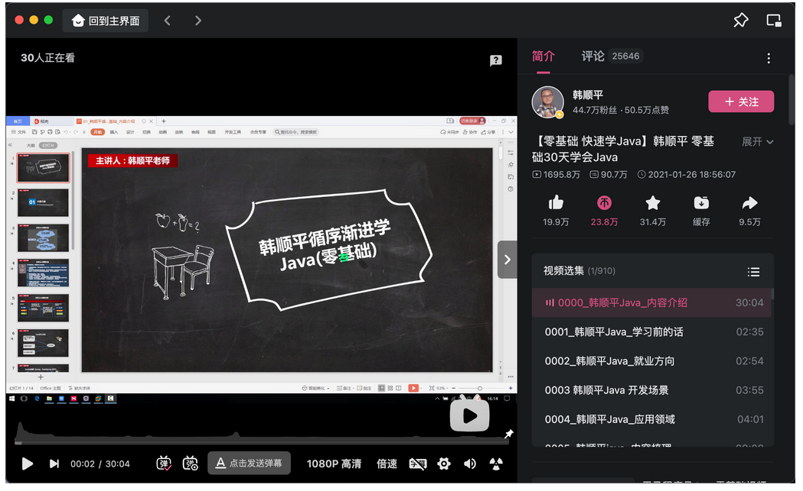

请注意，有语言基础的前面基础语法部分可以适当倍速或者跳过，Java语言的精髓部分请务必认真听讲，包括常见集合、Stream流、异常、反射、日志、多线程、单元测试等部分内容

## MySQL基础

在韩顺平 java 中就提到过，但是 MySQL 中的进阶点的知识也是需要学习的，这里推荐经典黑马的 MySQL

【黑马程序员 MySQL数据库入门到精通，从mysql安装到mysql高级、mysql优化全囊括】https://www.bilibili.com/video/BV1Kr4y1i7ru?vd_source=94f7ec5135fe225cc2503acda330c046

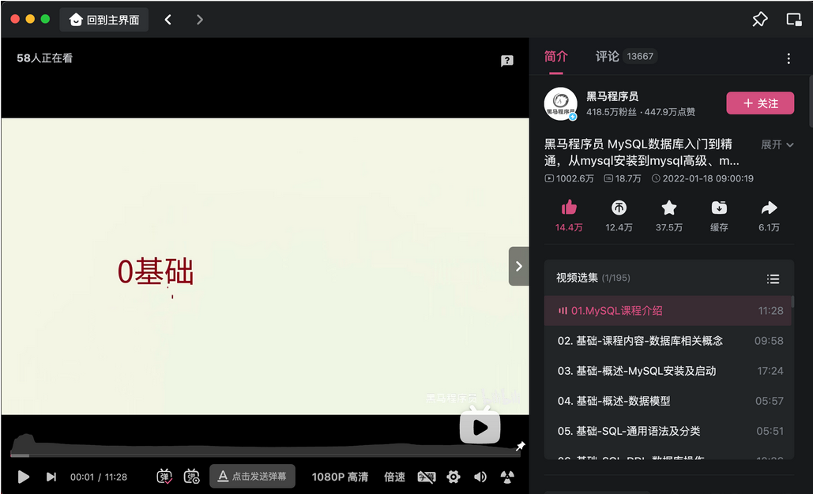

暂时学习完基础篇和进阶篇就行，等以后要提升了再看运维篇和 MySQL 45，进阶篇最好过一段时间就温习一次，很可能会温故而知新

## Web框架

java 后端都是要接触网络的，这个视频快速看一遍，有印象就行，这里提供两套课程，任选其一即可

【尚硅谷全新JavaWeb教程，企业主流javaweb技术栈】https://www.bilibili.com/video/BV1UN411x7xe?p=194&vd_source=94f7ec5135fe225cc2503acda330c046

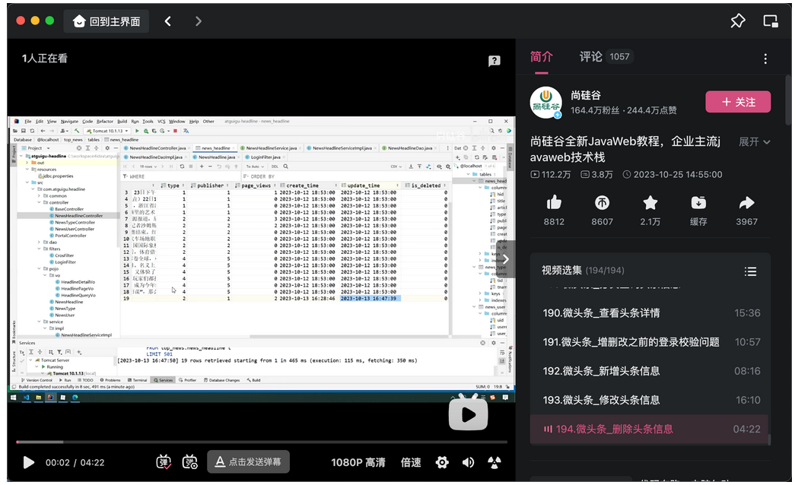

【全网首发AI+JavaWeb开发入门，Tlias教学管理系统项目实战全套视频教程，从需求分析、设计、前后端开发、测试、程序优化到项目部署一套搞定】 https://www.bilibili.com/video/BV1yGydYEE3H/?share_source=copy_web&vd_source=56a67a5728b5989ddf3ce61d936be20e

# 渐入佳境

## Spring Boot+MVC

java 能被选为常用后端开发语言的重要原因之一就是在框架的帮助下开发速度快，这些框架社区活跃，稳定性有保障

【【Spring5】尚硅谷Spring5教程】https://www.bilibili.com/video/BV1yq4y1Q7N7?vd_source=94f7ec5135fe225cc2503acda330c046

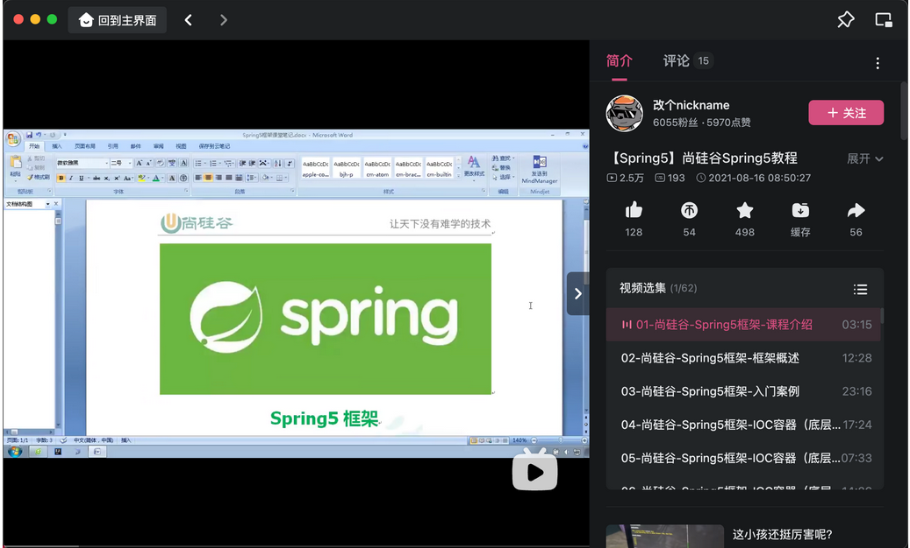

java 网络请求的处理在 spring 体系中被封装成 mvc，第一次学习这个只需要会基础的使用，有印象就行，等以后熟悉了可以去看看源码

【【尚硅谷】SpringMVC教程丨一套快速上手spring mvc】https://www.bilibili.com/video/BV1Ry4y1574R?vd_source=94f7ec5135fe225cc2503acda330c046

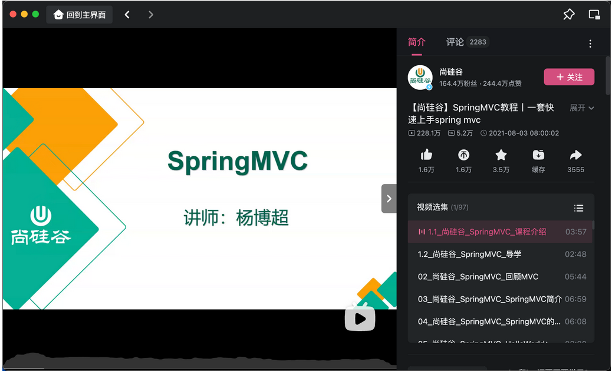

spring boot 简化了 spring 项目的开发，优化掉了繁琐的配置文件，很多配置都在 spring boot 中存在默认值

【尚硅谷SpringBoot3零基础教程，面试&加薪必会springboot（含响应式编程）】https://www.bilibili.com/video/BV1Es4y1q7Bf?vd_source=94f7ec5135fe225cc2503acda330c046

这个能通过 idea 软件快速构建一个项目就行了，这个视频一天以内学习如何使用基础的 spring boot 就行，至于中间一些组件的运行逻辑以后有兴趣就学，比如我个人是在学习这个一年后才明白大致的 spring boot 启动流程，中间一些组件的运行逻辑

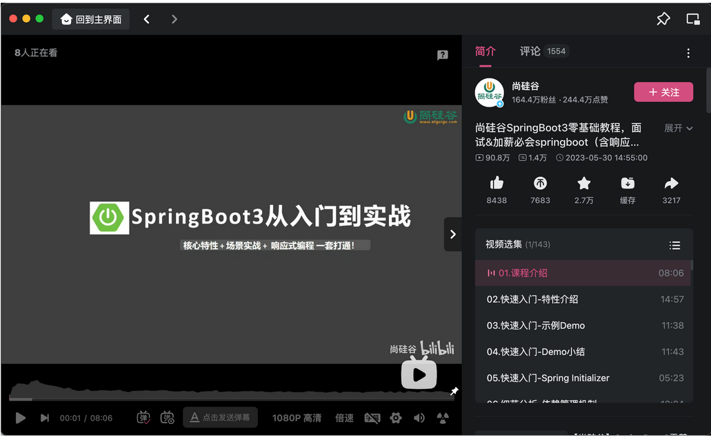

## 项目一 苍穹外卖

这是新手入门Java后端开发的第一个项目，项目用到的技术非常全面，很适合新手入门，有时间可以自己动手敲一敲，没时间也要简单过一遍

【黑马程序员Java项目实战《苍穹外卖》，最适合新手的SpringBoot+SSM的企业级Java项目实战】 https://www.bilibili.com/video/BV1TP411v7v6/?share_source=copy_web&vd_source=56a67a5728b5989ddf3ce61d936be20e

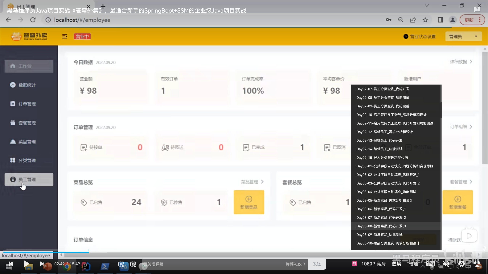

## Redis基础+项目二 黑马点评

这是新手入门Java后端开发的第二个项目，其中的Redis部分是非常重要的，已经是一个可以写到简历上的项目了（虽然不建议这样），这里看完实战篇就可以了

【黑马程序员Redis入门到实战教程，深度透析redis底层原理+redis分布式锁+企业解决方案+黑马点评实战项目】 https://www.bilibili.com/video/BV1cr4y1671t/?share_source=copy_web&vd_source=56a67a5728b5989ddf3ce61d936be20e

# 炉火纯青

作为一个计算机专业的学生，我们大一刚入学肯定知道我们专业的四大件，分别是：数据结构、计算机组成原理、操作系统、计算机网络；但对于一个就业向的Java程序员来说，真正的四大件是：MySQL、Redis、JVM、JUC，这是面试中最高频的内容，掌握了这些，你才真正了解那些Java代码是如何运行在你的电脑上

## MySQL高级

这里依然推荐经典黑马的 MySQL，在基础篇我们已经学完了基础，这里我们需要学习进阶篇和运维篇，尤其注意进阶篇中索引和锁的机制，这是面试中非常高频的问题，建议反复观看，常看常新

【黑马程序员 MySQL数据库入门到精通，从mysql安装到mysql高级、mysql优化全囊括】https://www.bilibili.com/video/BV1Kr4y1i7ru?vd_source=94f7ec5135fe225cc2503acda330c046

## Redis高级

依然是黑马的点评项目，到了这个阶段，需要你看完高级篇和原理篇，了解底层的原理

【黑马程序员Redis入门到实战教程，深度透析redis底层原理+redis分布式锁+企业解决方案+黑马点评实战项目】 https://www.bilibili.com/video/BV1cr4y1671t/?share_source=copy_web&vd_source=56a67a5728b5989ddf3ce61d936be20e

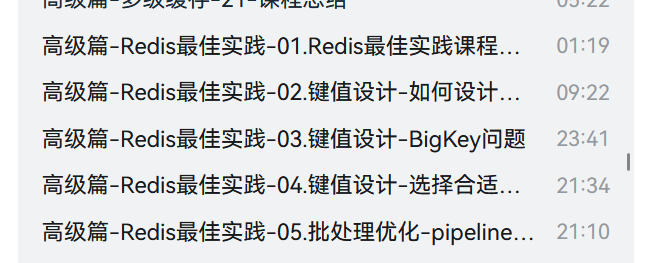

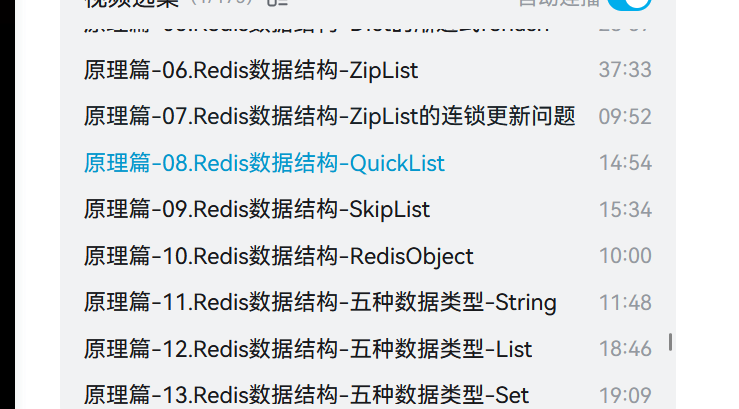

## JVM

JVM指Java虚拟机，也是面试非常高频的内容。这部分内容偏理论，建议观看时多做笔记，经常回顾，自己总结，这里推荐黑马17h的JVM课程

【黑马程序员JVM完整教程，Java虚拟机快速入门，全程干货不拖沓】 https://www.bilibili.com/video/BV1yE411Z7AP/?share_source=copy_web&vd_source=56a67a5728b5989ddf3ce61d936be20e

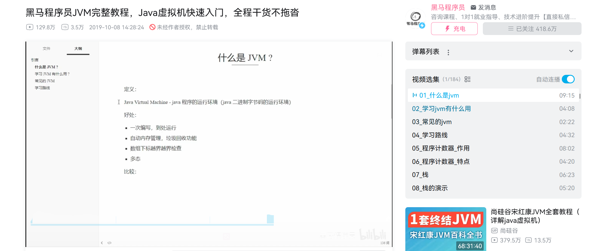

## JUC

这部分内容是多线程与并发编程的，也是面试非常高频的内容，全部内容都需要认真观看，看完之后一定会对并发编程有一个全新的认识

【黑马程序员深入学习Java并发编程，JUC并发编程全套教程】 https://www.bilibili.com/video/BV16J411h7Rd/?share_source=copy_web&vd_source=56a67a5728b5989ddf3ce61d936be20e

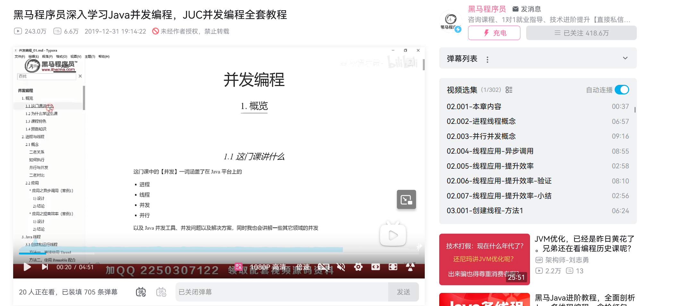

# 登峰造极

这里主要是微服务的技术栈，速成阶段不建议大家投入太多时间在这部分

## Spring cloud

## MQ

## MP

# 后记

学了以上的内容，当然还是远远不够的（），所以在文章的最后，给大家准备了一些开胃小菜，大家可以在以上内容的学习过程中，感到疲倦时学习下部分内容

## Git

这里的小知识点推荐使用尚硅谷的课程，课程时长刚刚好，学累了看看（GitLab可跳过）

【尚硅谷2024最新Git企业实战教程，全方位学习git与gitlab】 https://www.bilibili.com/video/BV1NK421Y7XZ/?share_source=copy_web&vd_source=56a67a5728b5989ddf3ce61d936be20e

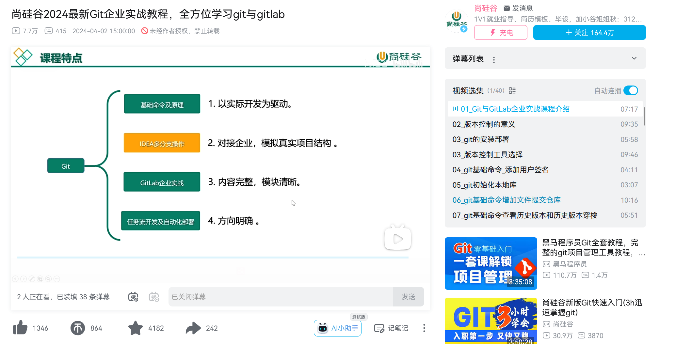

## Linux

【尚硅谷最新Linux零基础教程（linux快速入门，上手开发）】 https://www.bilibili.com/video/BV19W4y1w7cM/?share_source=copy_web&vd_source=56a67a5728b5989ddf3ce61d936be20e

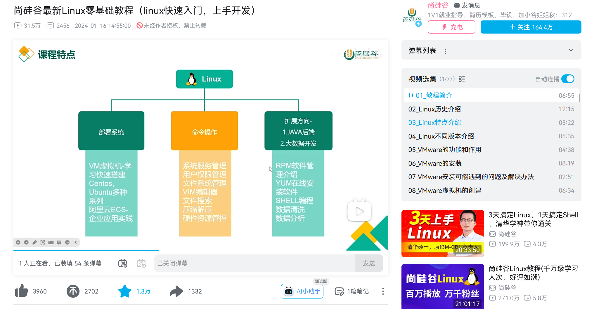

## 设计模式

【黑马程序员Java设计模式详解， 23种Java设计模式（图解+框架源码分析+实战）】 https://www.bilibili.com/video/BV1Np4y1z7BU/?share_source=copy_web&vd_source=56a67a5728b5989ddf3ce61d936be20e

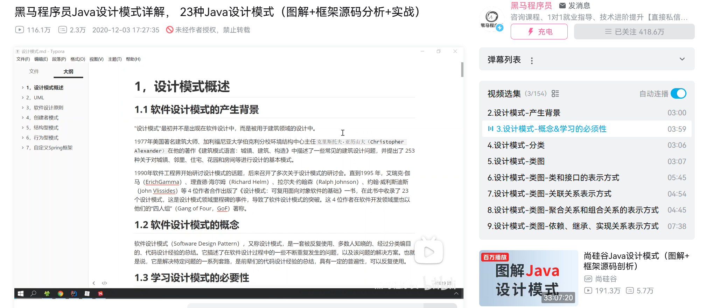

## 算法

速成Java就业，推荐大家使用代码随想录，跟着章节刷题，需要两个月左右掌握全部算法，之后刷leetcode的hot100，基本上就可以应付面试的算法题了

代码随想录https://www.programmercarl.com/

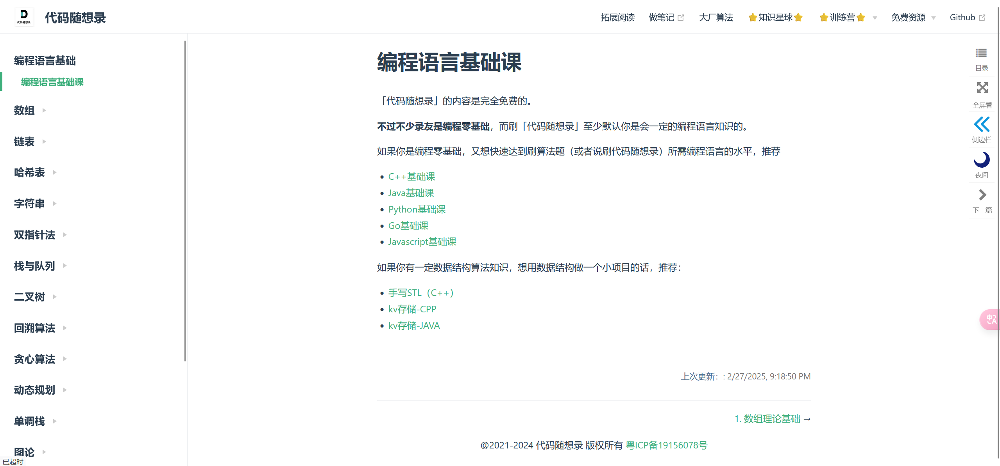

---
| **作者**：Emrys-a |  |
|-------------------------------|----------------------------------------------------------------------------------------------------|
