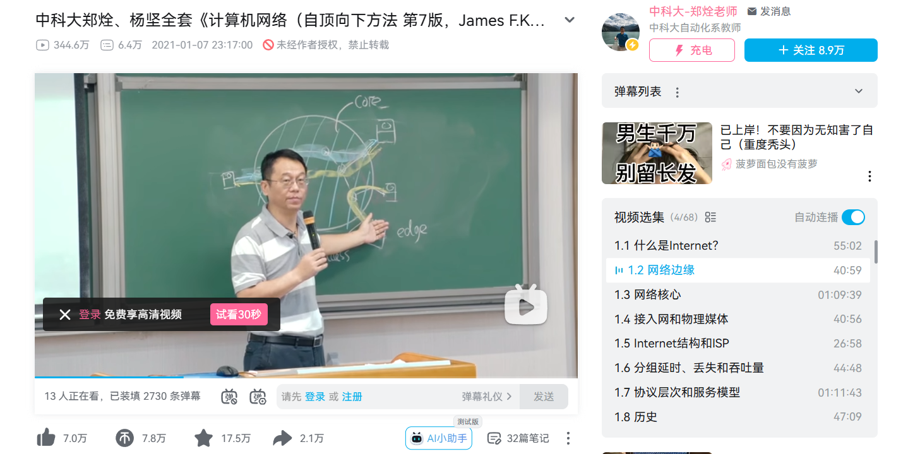
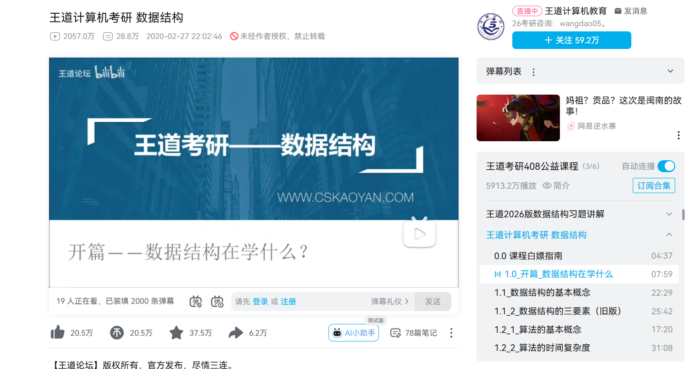
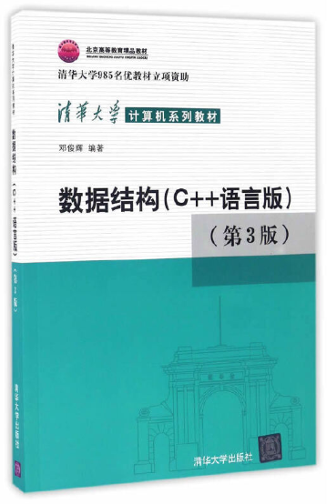
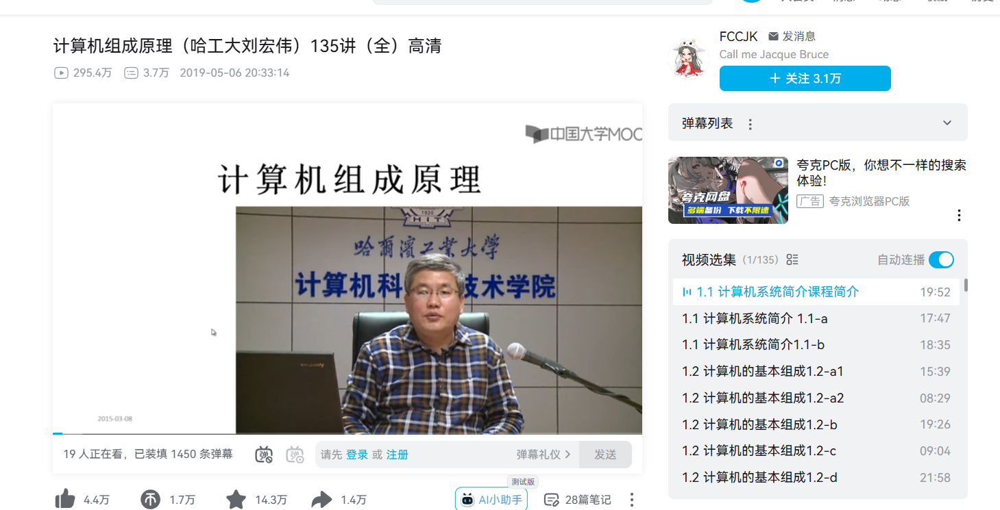
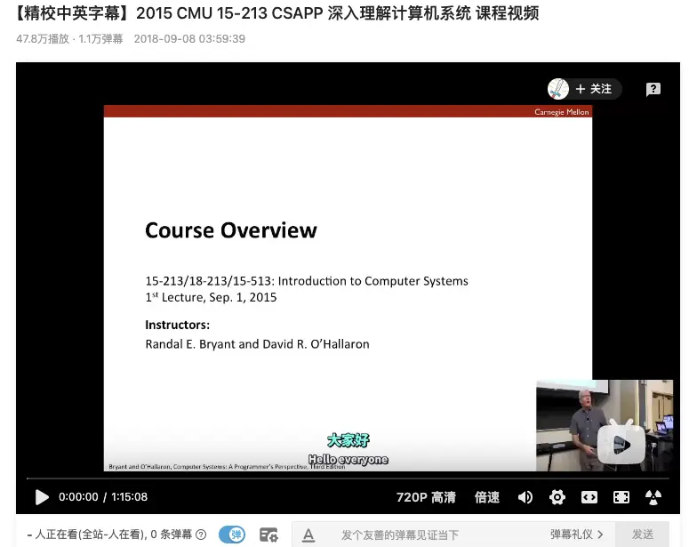
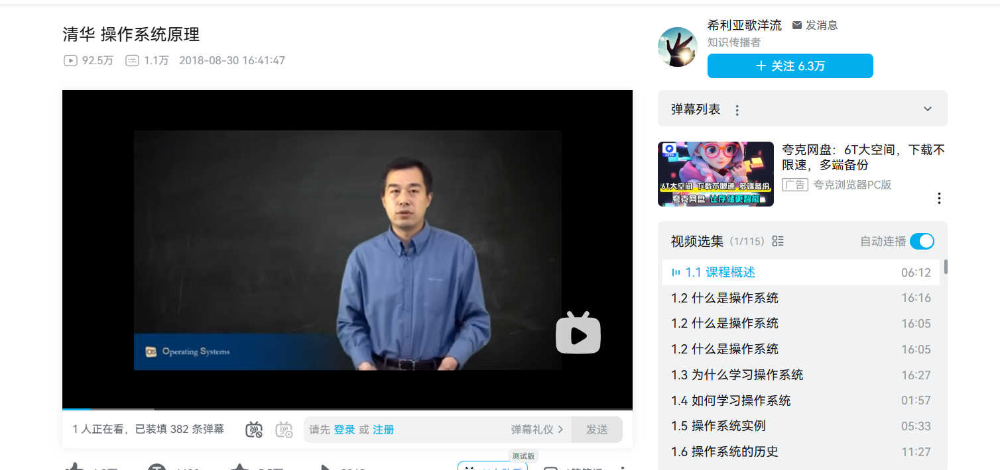

### 前言

> [!important] 
> 后端开发并不枯燥，也不难学，但是贵在坚持

> 下面的内容**最好掌握**，一般过一遍即可应付日常工作（基础架构这种岗位除外），但是如果你只是为了过面试/考试，最好找专门的资料进行详细的学习

### 后端开发基础
> 首先，你得学过一遍计算机的**四大件**
>   > **重要性**: 四大件是学习之后很多知识的基石，很多中间件的原理和思想都是来源于四大件的
>   1. 计算机网络
>   2. 数据结构
>   3. 计算机组成原理
>   4. 操作系统
#### 计算机网络
##### 1. 视频推荐
- B站-湖科大教书匠

**地址**：https://space.bilibili.com/360996402
##### 2. 书籍推荐
- 《计算机网络-自顶向下方法第七版》
- **下载地址**:https://github.com/TimorYang/Computer-Networking-Keith-Ross/blob/main/book/%E8%AE%A1%E7%AE%97%E6%9C%BA%E7%BD%91%E7%BB%9C-%E8%87%AA%E9%A1%B6%E5%90%91%E4%B8%8B%E6%96%B9%E6%B3%95%E7%AC%AC%E4%B8%83%E7%89%88.pdf
##### 3. 公开课推荐

- 课程网站：http://staff.ustc.edu.cn/~qzheng/teaching.html
- 课程视频：https://www.bilibili.com/video/BV1JV411t7ow/
- 课程课件：http://staff.ustc.edu.cn/~qzheng/cn.zip
- 课程教材：计算机网络（自顶向下方法 第7版），机械工业出版社，2016

#### 数据结构
##### 1. 视频推荐
王道的数据结构课程还是很好的（相比于课堂上的讲的可能更通俗易懂），是公认的考研好课。相对于其他以教学为目的的课程，专为考试制作的课会显得更加直接而高效，因为考试的核心目的就是拿分。

##### 2. 教材推荐
这本书是目前看到的最适合初学者自学的数据结构书籍。当然，说最合适自学，前提条件是要配合邓老师的MOOC视频和讲义看。（有一定的难度，但是要坚持下去！）
##### 3. 国外公开课推荐
**CS 61B**
伯克利 CS61 系列的第二门课程，注重数据结构与算法的设计，同时让学生有机会接触上千行的工程代码，通过 Java 初步领会软件工程的思想。
**b站介绍**：https://www.bilibili.com/video/BV1Nc1vYFEfP/?spm_id_from=333.337.search-card.all.click
（可以这么说，只要你在大一大二啃完这门课，基本已经半只脚进入了大厂）

#### 计算机组成原理
##### 1. 书籍推荐
这本书是一个微缩版的计算机组成原理，可以抱着比较轻松的心态在短时间内快速过完
**地址**：https://reachone01.github.io/计算机是怎样跑起来的.pdf
##### 2. 视频教程
视频推荐哈工大的课程，比啃课本稍微轻松一些

**地址**：https://www.bilibili.com/video/BV1t4411e7LH/
##### 3. 国外公开课

**地址**：https://www.bilibili.com/video/BV1iW411d7hd/
有精力也可以做做CSAPP的lab。做完之后收益巨大，因为当计算机体系搭建起来后，你后面再深入每一个课程的时候，你会发现学起来会比较轻松些。

#### 操作系统
##### 1. 书籍推荐
《操作系统导论》（Operating Systems: Three Easy Pieces）是一本深入浅出的经典教材，适合快速理解操作系统核心概念。
​​地址​​：http://pages.cs.wisc.edu/~remzi/OSTEP/
##### 2. 视频教程
推荐清华大学向勇老师的《操作系统原理》课程，讲解清晰且结合实践案例。

​​地址​​：https://www.bilibili.com/video/BV1uW411f72n/
##### 3. 国外公开课
MIT的《6.S081 Operating System Engineering》课程（含RISC-V实验），适合进阶学习。
https://example.com/mit-os-cover.png
​​地址​​：https://pdos.csail.mit.edu/6.S081/2020/
有精力可以完成课程的Lab项目（如XV6系统实验），实践后对系统底层理解会显著提升。后续学习其他计算机课程时会更得心应手。

---
**参考资源**：
- [UCB CS61B: Data Structures and Algorithms - CS自学指南](https://csdiy.wiki/%E6%95%B0%E6%8D%AE%E7%BB%93%E6%9E%84%E4%B8%8E%E7%AE%97%E6%B3%95/CS61B/)（含完整课程资源、作业实现和中文翻译）
- [小林coding的学习心得](https://xiaolincoding.com/cs_learn/)（含计算机基础学习建议和社群资源）
- [二哥的Java进阶之路](https://javabetter.cn/xuexiluxian/)（多语言技术栈学习路线）