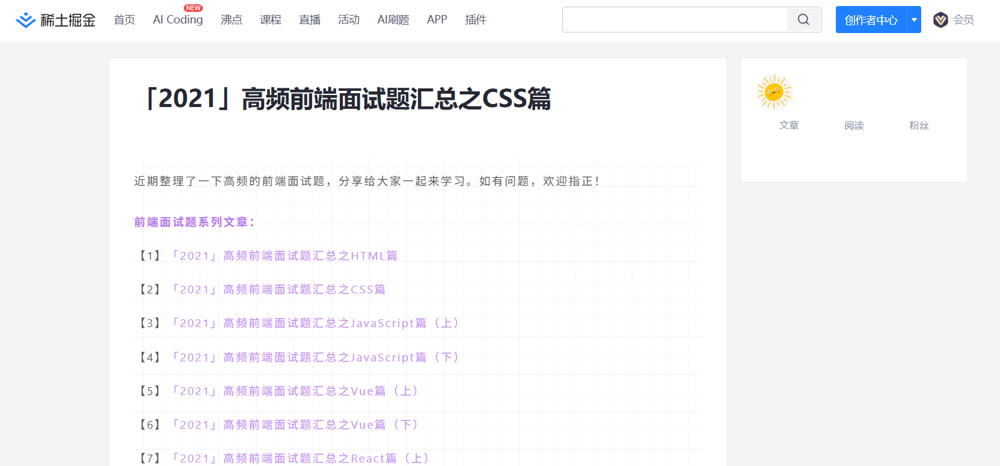
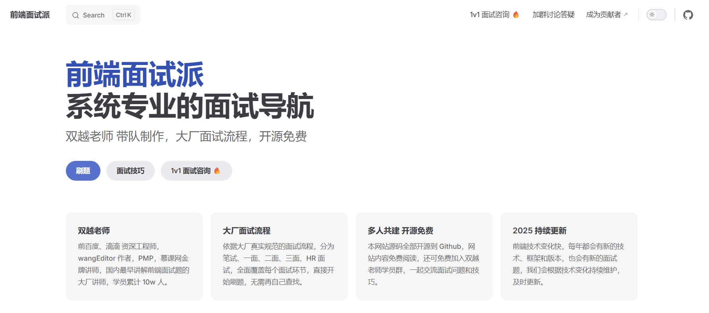

# 前端路线

## 1 必学的技术栈

### 1.1三件套（HTML CSS JavaScript）

#### 1.1.1推荐网站

​	100dayscss.com（css练习网站 ）

#### 1.1.2推荐书籍

​	1、红宝书（JavaScript高级程序设计）

下载链接：https://raw.githubusercontent.com/Mrrabbitan/learningMaterials/master/JavaScript%E9%AB%98%E7%BA%A7%E7%A8%8B%E5%BA%8F%E8%AE%BE%E8%AE%A1%EF%BC%88%E7%AC%AC4%E7%89%88%EF%BC%89.pdf

### 1.2框架

​	常见的有VUE、React、Angular等。建议前期VUE、React二者二选一即可，时间紧张建议学VUE。学习框架的不仅要学框架本身，还有框架常用的生态，例如VUE3的Pinia、VueUse、VueRouter，React的ReduX、React Router等。

​	学习框架可以看视频，但强烈建议跟着官方文档学习，一是文档比较完善，而是培养看文档的能力，为以后工作学习打好基础。

## 2 建议学习的

### 2.1Ajax

​	XMLHttpRequest（了解即可）

​	Fetch API

​	Axios（基于Promise封装的网络请求的库，重点学习）

注：这一部分不用花太多时间，找个较全面的文档敲几个demo就好，后面在项目中熟悉

### 2.2DevTools（调试工具）

​	HTML调试（Elements）

​	JavaScript调试（console、 Source）

​	网络请求调试（NetWork）

### 2.3包管理器

​	建议先从npm开始入门、后续再扩展pnpm、yarn等

### 2.4构建工具（Webpack Vite）

​	前端工程化基础，工作后一定要深入学习的

### 2.5TypeScript

​	时间充足建议学习，大厂用的很多

## 3 面试准备

### 3.1 八股（技术基础以及408基础）

#### 3.1.1推荐网站

[「2021」高频前端面试题汇总之CSS篇2021 高频前端面试题汇总之CSS篇，前端面试题汇总系列文章的CSS篇，长期更 - 掘金](https://juejin.cn/post/6905539198107942919#heading-10)

[前端面试派](https://www.mianshipai.com/)

### 3.2手撕

​	前端面试手撕有两种，一种是常规算法题，一种是语言特性题，这里重点讲后者。

​	语言特定重点考察js的一些语言特性，例如手撕对象继承，手撕一些常用的api，例如call()、apply()、bind()、Promise.all()等，这里推荐一个视频。

[【优化中...】死磕36道JS手写题，搞定后提升真挺大！【一起啃书】【嗨Sirius】_哔哩哔哩_bilibili](https://www.bilibili.com/video/BV1P44y1y7YT/?spm_id_from=333.337.search-card.all.click&vd_source=812d48a2999659cc6302663e877b0761)

---
| **作者**：不称职演说家 |  |
|-------------------------------|----------------------------------------------------------------------------------------------------|
