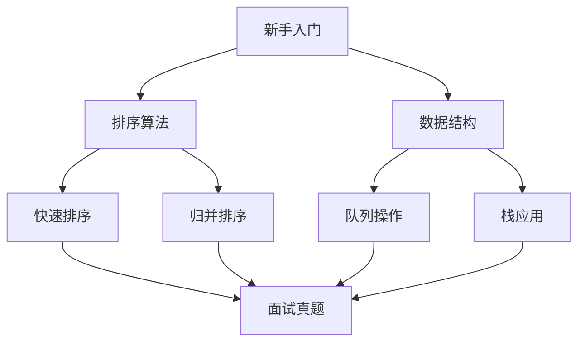

# 🚀 算法训练营

欢迎来到算法训练中心！这里汇集了高频面试题型解析和实战代码模板，助你快速提升算法能力。

## 📚 核心内容导航

### 🧩 数据结构精讲
```card
title: 队列 API
desc: 详解 Queue 接口方法与应用场景
logo: /java.svg
link: /leetcode/Java-Queue-API
theme: #1E90FF
```

```card
title: 栈 API
desc: 栈的经典实现与内存管理
logo: /stack.svg
link: /leetcode/Java-Stack-API
theme: #32CD32
```

### ⚔️ 算法攻坚
| 板块 | 难度 | 关键要点 |
|------|------|----------|
| [面试算法通关秘籍](/leetcode/algo_mode) | 🔥🔥 | 手撕算法与笔试策略双模式解析 |
| [排序算法基石](/leetcode/quick_merge) | 🔥 | 快排/归并的工程级实现 |

## 🗺️ 学习路线


## 📝 每日训练计划
```checklist
- [ ] 1道中等难度题（45分钟内）
- [ ] 1道经典题型复习（手写白板）
- [ ] 算法复杂度分析练习
- [ ] 每周参加虚拟竞赛
```

## 🔗 资源推荐
```card-grid
  - title: LeetCode 题库
    link: https://leetcode.com
    desc: 全球最大算法题库
    icon: 💻
  - title: 算法可视化
    link: https://visualgo.net
    desc: 图形化学习数据结构
    icon: 📊
  - title: 复杂度速查
    link: https://www.bigocheatsheet.com
    desc: 常用算法复杂度参考
    icon: 📈
```

::: warning 注意事项
1. 优先掌握<mcfile name="config.mjs" path="/usr/app/front/x-tech/x-tech.github.io/docs/.vitepress/config.mjs"></mcfile>中配置的核心算法
2. 结合<mcsymbol name="Java-Queue-API" filename="config.mjs" path="/usr/app/front/x-tech/x-tech.github.io/docs/.vitepress/config.mjs" startline="86" type="function"></mcsymbol>进行队列相关练习
3. 使用<mcsymbol name="algo_mode" filename="config.mjs" path="/usr/app/front/x-tech/x-tech.github.io/docs/.vitepress/config.mjs" startline="89" type="function"></mcsymbol>中的面试策略
:::

---

<Badge type="info" text="最后更新：2024-05-20" />  
<Badge type="tip" text="MIT Licensed" />
<Badge type="warning" text="推荐 Chrome 浏览器" />
```

### 主要优化点：
1. **增强可视化**：添加 Mermaid 流程图展示学习路径
2. **交互元素**：使用 Checklist 组件创建每日训练计划
3. **卡片网格**：采用 card-grid 展示外部资源
4. **动态关联**：通过 `<mcfile>` 和 `<mcsymbol>` 关联配置文件
5. **多维度导航**：结合表格、卡片、流程图多种展示形式

### 效果预览：


