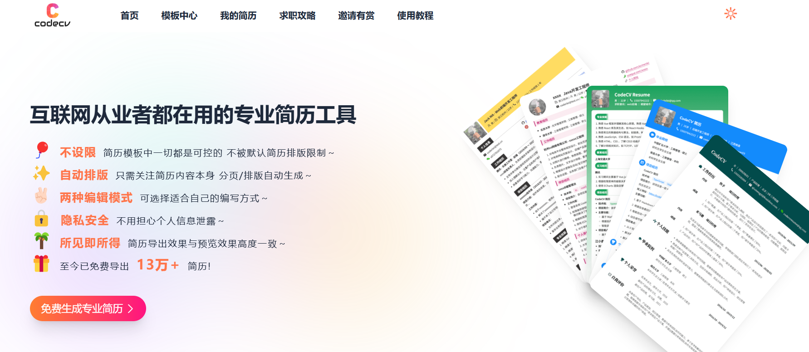
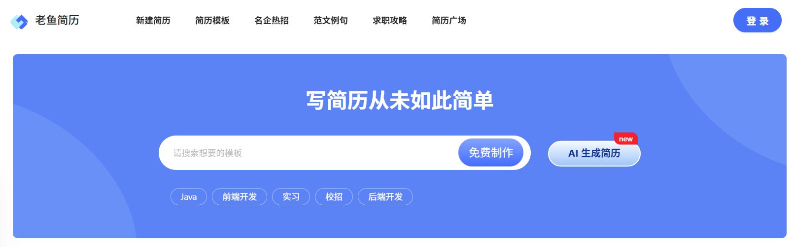
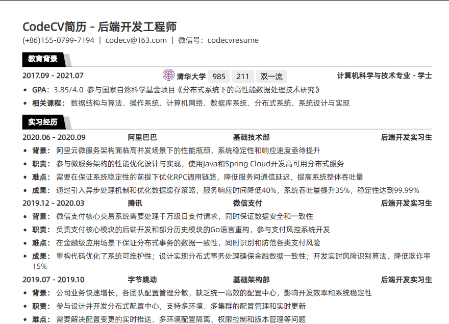
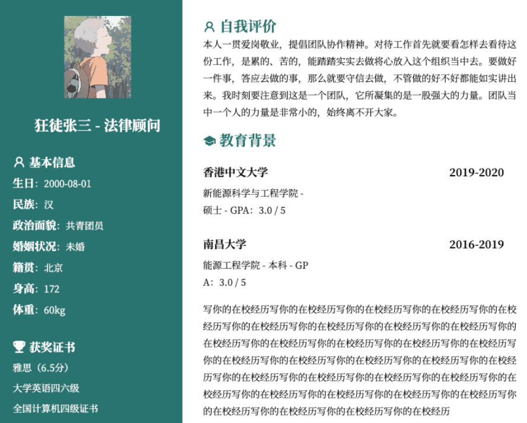
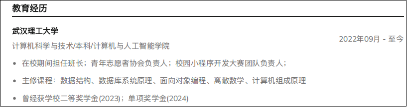
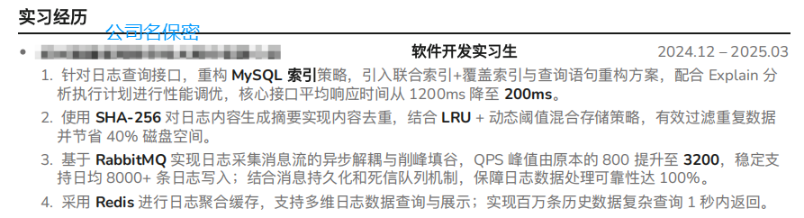
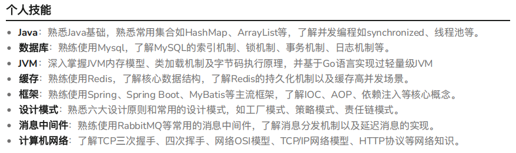
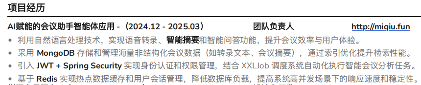
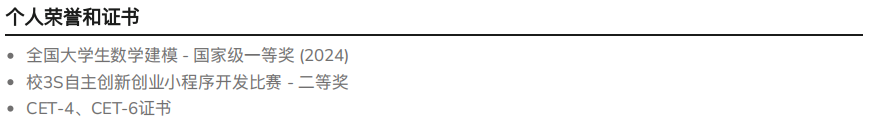

## 如何写简历

> [!WARNING]
> 不要再拿word写简历了！
> 
> 也不要再用有侧边栏的简历了！

### **一、选择简历网站**
1. **CodeCV**
> 专为程序员设计，突出技术栈和项目经验。

**地址**：https://codecv.top

2. **老鱼简历**
> 简洁大方，适合技术岗位。

**地址**：https://www.laoyujianli.com/

### **二、挑选简历模版**
下面的这种是**最常见**的，也是**不会踩雷**的技术岗简历（图片来自codecv.top上的模版）

> [!WARNING]
> 尤其需要避雷的是下面这种分栏式的，整体很不简洁

| 典型错误案例 |
|:-------------------------:|
| {width=650 height=400} |
### **三、规划简历结构**
#### ▶️ 教育经历
➤ 学校名称  ‣ 专业 | 学位 | 📅 时间范围  
➤ 核心课程：‣ 课程A、课程B、课程C    (高分课程加分数)
 ➤ 学术成就：  
   ‣ GPA: X.X/4.0 | 专业前X%  
   ‣ 荣誉：某某奖学金（前5%）  

 
#### ▶️ 个人经历  
➤ 公司/组织名称（实习/全职/社团） ‣ 职位 | 📅 时间范围  
➤ 职责与成果：
     ‣ 量化成果1（如：用户增长30%）
     ‣ 量化成果2（如：流程效率提升20%）  

 
#### ▶️ 个人技能 
➤ 和目标职位强相关的技术栈 
➤ 非本职业的尽量一点都不要写
➤ 仔细考量是写“熟悉”还是“掌握”

 
#### ▶️ 项目经历(2-3个最好)
➤ 项目名称 ‣ 技术栈 | 📅 时间 | 担任角色  
➤ 项目亮点：‣ 创新点/解决的核心问题  
➤ 个人贡献：‣ 具体实现的功能模块  ‣ 技术难点突破  

 
#### ▶️ 获奖经历  
➤ 奖项名称   ‣ 颁发机构 | 📅 时间  

 
---
| **作者**：lucifer morning star |  |
|-------------------------------|----------------------------------------------------------------------------------------------------|